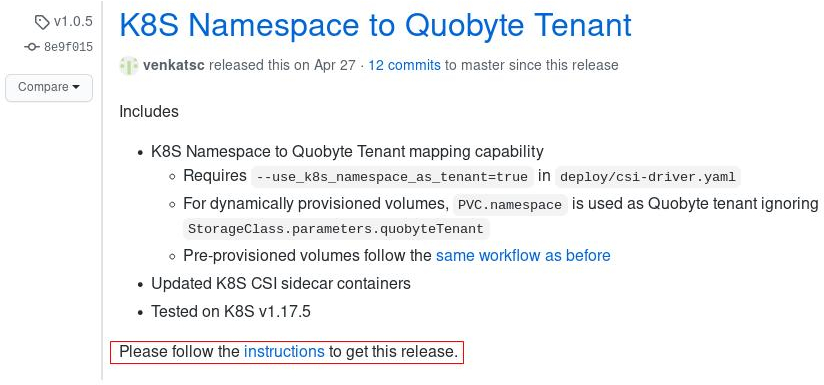

# Quobyte CSI

Quobyte CSI is the implementation of
 [Container Storage Interface (CSI)](https://github.com/container-storage-interface/spec/tree/release-1.0).
 Quobyte CSI enables easy integration of Quobyte Storage into Kubernetes. Current Quobyte CSI plugin
 supports the following functionality

* Dynamic Volume Create
* Volume Delete
* Pre-provisioned volumes (Delete policy does not apply to these volumes)
* Volume Expansion (Only dynamically provisioned volumes can be expanded)

## Select Quobyte CSI Driver Release

1. Choose the Quobyte CSI release from [available releases](https://github.com/quobyte/quobyte-csi/releases)

2. Follow the instructions specific to that release
  
  

## Index

* [Requirements](#requirements)
* [Deploy Quobyte clients](docs/deploy_clients.md)
* [Deploy Quobyte CSI](#deploy-quobyte-CSI)
* [Use Quobyte volumes in Kubernetes](#use-quobyte-volumes-in-kubernetes)
  * [Dynamic volume provisioning](#dynamic-volume-provisioning)
  * [Use existing volumes](#use-existing-volumes)
* [Volume Snapshots](#volume-snapshots)
  * [Dynamic Snapshots](#dynamic-snapshots)
  * [Pre-provisioned Snapshots](#pre\-provisioned-snapshots)
* [Secure storage access with PSPs](docs/secure-storage-with-psp.md)
* [Uninstall Quobyte CSI](#uninstall-quobyte-csi)
* [Multi-cluster setup](docs/multi-cluster-setup.md)
* [Collect Quobyte CSI logs](docs/collect_quobyte_csi_logs.md)

## Requirements

* Requires `git` on k8s master node
* Requires at least Kubernetes v1.16 (tested with v1.18.5)
* Quobyte installation with reachable registry and api services from the Kubernetes nodes and pods
* Quobyte client with mount path as `/mnt/quobyte/mounts`. Please see
 [Deploy Quobyte clients](docs/deploy_clients.md) for Quobyte client installation instructions.
  * To use Quobyte access keys, the Quobyte client (requires Quobyte version 3.0 or above) should
   be deployed with **--enable-access-contexts**
* Requires [additional setup](#setup-snapshotter) to use volume snapshots

## Deploy Quobyte CSI Driver

1. Set your chosen release version

    ```bash
    # For example, to install Quobyte CSI release v1.0.5,
    # please set RELEASE_TAG="v1.0.5"
    RELEASE_TAG="<YOUR_CHOSEN_RELEASE>"
    ```

2. Clone the quobyte CSI repository from github on k8s master node

    ```bash
    git clone https://github.com/quobyte/quobyte-csi.git && cd quobyte-csi \
     && git checkout tags/$RELEASE_TAG
    ```

3. Helm is required to deploy the Quobyte CSI driver. Please
 install [Helm](https://helm.sh/docs/intro/install/#from-script) on the k8s master node.

    ```bash
    curl -fsSL -o get_helm.sh https://raw.githubusercontent.com/helm/helm/master/scripts/get-helm-3 \
    && chmod 700 get_helm.sh && ./get_helm.sh
    ```

4. Edit [CSI driver configuration](quobyte-csi-driver/values.yaml) (./quobyte-csi-driver/values.yaml) and configure CSI driver
   with Quobyte API, other required information.

5. (optional) generate driver deployment `.yaml` and verify the configuration.

    ```bash
    helm template ./quobyte-csi-driver --debug > csi-driver.yaml
    ```

6. Deploy the Quobtye CSI driver (deploys driver with configuration from step 3)

    ```bash
    # Depolys helm chart with name "quobyte-csi".
    # Please change quobyte-csi as required
    helm install quobyte-csi ./quobyte-csi-driver
    ```

7. Verify the status of Quobyte CSI driver pods

    Deploying Quobyte CSI driver should create a CSIDriver object
     with your `csiProvisionerName` (this may take few seconds)

    ```bash
    CSI_PROVISIONER="<YOUR-csiProvisionerName>"
    kubectl get CSIDriver | grep ^${CSI_PROVISIONER}
    ```

    The Quobyte CSI plugin is ready for use, if you see `quobyte-csi-controller-x`
    pod running on any one node and `quobyte-csi-node-xxxxx`
    running on every node of the Kubernetes cluster.

    ```bash
    CSI_PROVISIONER=$(echo $CSI_PROVISIONER | tr "." "-")
    kubectl -n kube-system get po -owide | grep ^quobyte-csi-.*-${CSI_PROVISIONER}
    ```

8. Make sure your CSI driver is running against the expected Quobyte API endpoint

    ```bash
    kubectl -n kube-system exec -it \
    "$(kubectl get po -n kube-system | grep -m 1 ^quobyte-csi-node-$CSI_PROVISIONER \
    |  cut -f 1 -d' ')" -c quobyte-csi-plugin -- env | grep QUOBYTE_API_URL
    ```

    The above command should print your Quobyte API endpoint.
    After that, uninstall Quobyte CSI driver and install again.

## Use Quobyte volumes in Kubernetes

`Note:` This section uses `example/` deployment files for demonstration. These should be modified
  with your deployment configurations such as `namespace`, `quobyte registry`, `Quobyte API user credentials` etc.

We use `quobyte` namespace for the examples. Create the namespace

  ```bash
  kubectl create ns quobyte
  ```

Quobyte requires a secret to authenticate volume create and delete requests. Create this secret with
 your Quobyte API login credentials (Kubernetes requires base64 encoding for secret data which can be obtained
 with the command `echo -n "value" | base64`). Please encode your user name, password (and optionally access key
 information) in base64 and update [example/csi-secret.yaml](example/csi-secret.yaml). If provided, access key
 ensures only authorized user can access the tenant and volumes (users must be restricted to their own namespace in k8s cluster).

  ```bash
  kubectl create -f example/csi-secret.yaml
  ```

Create a [storage class](example/StorageClass.yaml) with the `provisioner` set to `csi.quobyte.com` along with other configuration
 parameters. You could create multiple storage classes by varying `parameters` such as
  `quobyteTenant`, `quobyteConfig` etc.

  ```bash
  kubectl create -f example/StorageClass.yaml
  ```

To run the **Nginx demo** pods,

1. Host nodes must have nginx user (UID: 101) and group (GID: 101). Please
 create nginx user and group on every node.

    ```bash
    sudo groupadd -g 101 nginx; sudo useradd -u 101 -g 101 nginx
    ```

2. `nginx` user must have at least read and execute permissions on the volume

### Dynamic volume provisioning

Creating a PVC referencing the storage class created in the previous step would provision dynamic
 volume. The secret `csi.storage.k8s.io/provisioner-secret-name` from the namespace `csi.storage.k8s.io/provisioner-secret-namespace`
 in the referenced StorageClass will be used to authenticate volume creation and deletion.

1. Create [PVC](example/pvc-dynamic-provision.yaml) to trigger dynamic provisioning

    ```bash
    kubectl create -f example/pvc-dynamic-provision.yaml
    ```

2. Mount the PVC in a [pod](example/nginx-demo-pod-with-dynamic-vol.yaml) as shown in the following example

    ```bash
    kubectl create -f example/nginx-demo-pod-with-dynamic-vol.yaml
    ```

3. Wait for the pod to be in running state

    ```bash
    kubectl get po -w | grep 'nginx-dynamic-vol'
    ```

4. Once the pod is running, copy the [index file](example/index.html) to the deployed nginx pod

    ```bash
    kubectl cp example/index.html nginx-dynamic-vol:/usr/share/nginx/html/
    ```

5. Access the home page served by nginx pod from the command line

    ```bash
    curl http://$(kubectl get pods nginx-dynamic-vol -o yaml | grep ' podIP:' | awk '{print $2}'):80
    ```

  Above command should retrieve the Quobyte CSI welcome page (in raw html format).

### Use existing volumes

Quobyte CSI requires the volume UUID to be passed on to the PV as `VolumeHandle`  

* Quobyte-csi supports both volume name and UUID
  * **To use Volume Name** `VolumeHandle` should be of the format `<Tenant_Name/UUID>|<Volume_Name>`
   and `nodePublishSecretRef` with Quobyte API login credentials should be specified as shown in the
   example PV `example/pv-existing-vol.yaml`
  * **To use Volume UUID** `VolumeHandle` can be `|<Volume_UUID>`.

In order to use the pre-provisioned `test` volume belonging to the tenant `My Tenant`, user needs to create
 a PV with `volumeHandle: My Tenant|test` as shown in the [example PV](example/pv-existing-vol.yaml).

1. Edit [example/pv-existing-vol.yaml](example/pv-existing-vol.yaml) and point it to the the pre-provisioned volume in Quobyte
 storage through `volumeHandle`. Create the PV with pre-provisioned volume.

    ```bash
    kubectl create -f example/pv-existing-vol.yaml
    ```

2. Create a [PVC](example/pvc-existing-vol.yaml) that matches the storage requirements with the above PV (make sure both PV and PVC refer
 to the same storage class). The created PVC will automatically binds to the PV.

    ```bash
    kubectl create -f example/pvc-existing-vol.yaml
    ```

3. Create a [pod](example/nginx-demo-pod-with-existing-vol.yaml) referring the PVC as shown in the below example

    ```bash
    kubectl create -f example/nginx-demo-pod-with-existing-vol.yaml
    ```

4. Wait for the pod to be in running state

    ```bash
    kubectl get po -w | grep 'nginx-existing-vol'
    ```

5. Once the pod is running, copy the [index file](example/index.html) to the deployed nginx pod

    ```bash
    kubectl cp example/index.html nginx-existing-vol:/usr/share/nginx/html/
    ```

6. Access the home page served by nginx pod from the command line

    ```bash
    curl http://$(kubectl get pods nginx-existing-vol -o yaml | grep ' podIP:' | awk '{print $2}'):80
    ```

    The above command should retrieve the Quobyte CSI welcome page (in raw html format).

## Volume snapshots

### Snapshot Requirements

1. Quobyte CSI Driver is deployed with snapshots enabled

2. [Snapshotter setup](#setup-snapshotter)

### Dynamic Snapshots

  1. Provision a PVC for a Quobyte volume by following [instructions](#use-quobyte-volumes-in-kubernetes)

  2. Populate backing volume with [nginx index file](example/index.html)

      ```bash
      VOLUME="<Quobyte-Volume>" # volume for which snapshot will be taken
      wget https://raw.githubusercontent.com/quobyte/quobyte-csi/master/example/index.html -P /mnt/quobyte/mounts/$VOLUME
      ```

  3. Create [volume snapshot secrtes](example/csi-secret.yaml)

     Our examples use same secret in all the places wherever secret is required. Please create and
     configure secrets as per your requirements.

        ```bash
        kubectl create -f example/csi-secret.yaml
        ```

  4. Create volume [snapshot class](example/volume-snapshot-class.yaml)

        ```bash
        kubectl create -f example/volume-snapshot-class.yaml
        ```

  5. Create [dynamic volume snapshot](example/volume-snapshot-dynamic-provision.yaml)

        ```bash
        kubectl create -f example/volume-snapshot-dynamic-provision.yaml
        ```

     The above command should create required `volumesnapshotcontent` object dynamically
  
  6. (optional) verify created `volumesnapshot` and `volumesnapshotcontent` objects

        ```bash
        kubectl get volumesnapshot
        kubectl get volumesnapshotcontent
        ```

  7. [Restore snapshot](example/restore-snapshot-pvc.yaml) and create PVC

        ```bash
        kubectl create -f example/restore-snapshot-pvc.yaml
        ```
  
  8. Create pod with [restored snapshot](example/nginx-demo-pod-with-snapshot-vol.yaml)

        ```bash
        kubectl create -f example/nginx-demo-pod-with-snapshot-vol.yaml
        ```
  
### Pre-provisioned Snapshots

  1. Create `VolumeSnapshotContent` object for pre-provisioned volume with
   [required configuration](example/volume-snapshot-content-pre-provisioned.yaml)

        ```bash
        kubectl create -f example/volume-snapshot-content-pre-provisioned.yaml
        ```

  2. Create `VolumeSnapshot` object by adjusting the [example snapshot object](example/volume-snapshot-pre-provisioned.yaml)

        ```bash
        kubectl create -f example/volume-snapshot-pre-provisioned.yaml
        ```
  
  3. (optional) verify created `volumesnapshot` and `volumesnapshotcontent` objects

        ```bash
        kubectl get volumesnapshot
        kubectl get volumesnapshotcontent
        ```

  4. [Restore snapshot](example/restore-snapshot-pvc.yaml)

        ```bash
        kubectl create -f example/restore-snapshot-pvc.yaml
        ```

## Uninstall Quobyte CSI

1. Delete Quobyte CSI containers and corresponding RBAC

    List available helm charts

    ```bash
    helm list
    ```

    Delete intended chart

    ```bash
    helm delete <Quobyte-CSI-chart-name>
    ```

## Setup Snapshotter

The below setup is required once per k8s cluster

  ```bash
    # https://github.com/kubernetes-csi/external-snapshotter/
    wget -q https://raw.githubusercontent.com/kubernetes-csi/external-snapshotter/v2.1.1/config/crd/snapshot.storage.k8s.io_volumesnapshotclasses.yaml;
    wget -q https://raw.githubusercontent.com/kubernetes-csi/external-snapshotter/v2.1.1/config/crd/snapshot.storage.k8s.io_volumesnapshotcontents.yaml;
    wget -q https://raw.githubusercontent.com/kubernetes-csi/external-snapshotter/v2.1.1/config/crd/snapshot.storage.k8s.io_volumesnapshots.yaml

    kubectl create -f snapshot.storage.k8s.io_volumesnapshotcontents.yaml; kubectl create -f snapshot.storage.k8s.io_volumesnapshots.yaml;
    kubectl create -f snapshot.storage.k8s.io_volumesnapshotclasses.yaml; kubectl create -f quobyte-csi-driver/k8s-snapshot-controller.yaml 
  ```
